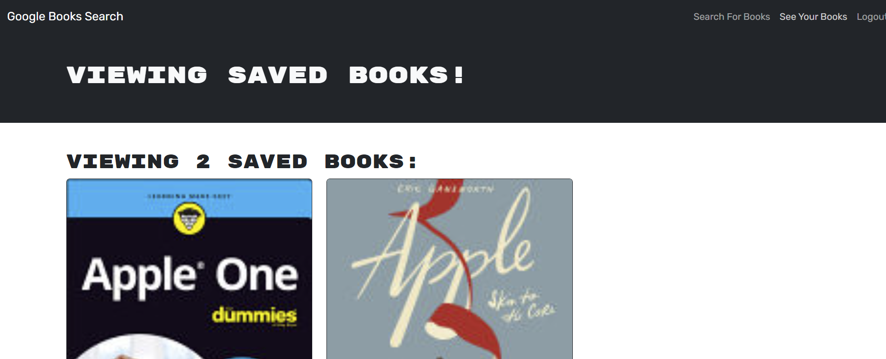

# Book Search Engine

## Description

This Google Book search engine, utilizing React as the front end, and MongoDB/Mongoose ODM, and GraphQL to handle database queries, was created by ylf456 for educational purposes.

## Installation

To use this application, Open the following link deployed in Render in your browser: https://book-search-engine-1-5jz2.onrender.com/

If you want to further develop this app on your local device, download the source package from my Github repo: https://github.com/ylf456/Book-Search-Engine.git 

Ensure you have following installed on your device:
- Any Coding platform such as VScode.
- Node.js
- MongoDB

To initialize this app, change the directory to the root folder in the terminal and run the following commands:
1. run `npm run install` 
2. run `npm run develop`
to host the app on your local device. 

## Usage

In the search book page of the app, you can search for a book in the input area to find it on Google. If you are logged in as a user, you can save books rendered in the lower section under the search bar to your profile page and find your saved books by clicking on the "See your books" tab on the navbar. In your profile page, you can also delete unwanted saved books.

## Credits

This application was refactored from the RESTful version, and the front-end functionalities were provided by the starter code in:  https://github.com/coding-boot-camp/solid-broccoli.git.

## License

MIT License

Copyright (c) 2024 ylf456

Permission is hereby granted, free of charge, to any person obtaining a copy
of this software and associated documentation files (the "Software"), to deal
in the Software without restriction, including without limitation the rights
to use, copy, modify, merge, publish, distribute, sublicense, and/or sell
copies of the Software, and to permit persons to whom the Software is
furnished to do so, subject to the following conditions:

The above copyright notice and this permission notice shall be included in all
copies or substantial portions of the Software.

THE SOFTWARE IS PROVIDED "AS IS", WITHOUT WARRANTY OF ANY KIND, EXPRESS OR
IMPLIED, INCLUDING BUT NOT LIMITED TO THE WARRANTIES OF MERCHANTABILITY,
FITNESS FOR A PARTICULAR PURPOSE AND NONINFRINGEMENT. IN NO EVENT SHALL THE
AUTHORS OR COPYRIGHT HOLDERS BE LIABLE FOR ANY CLAIM, DAMAGES OR OTHER
LIABILITY, WHETHER IN AN ACTION OF CONTRACT, TORT OR OTHERWISE, ARISING FROM,
OUT OF OR IN CONNECTION WITH THE SOFTWARE OR THE USE OR OTHER DEALINGS IN THE
SOFTWARE.

## Link to this application

Render deployment: https://book-search-engine-1-5jz2.onrender.com/

Github Repo: https://github.com/ylf456/Book-Search-Engine.git 

## Screenshots

